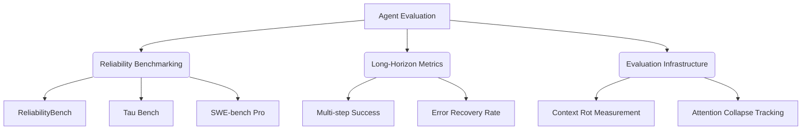

## The Illusion of pass@1

In the early days of evaluating Large Language Models for coding, the industry standard metric was **pass@1**. The methodology was simple: give the model a discrete problem (like a LeetCode algorithm), let it generate a single response, and check if the code passes the unit tests on the very first try. 

While pass@1 was useful for measuring raw coding capability in a vacuum, it has become fundamentally obsolete in the era of autonomous AI agents. Modern AI agents are not just writing standalone functions; they are navigating file systems, debugging complex server errors, and orchestrating multi-step deployments. 

If an agent fails to write the correct code on its first try, but successfully reads the error log, identifies its mistake, and patches the code on the second try, it is demonstrating high agency and reliability. Yet, under a strict pass@1 metric, this agent would score a zero. 

To accurately evaluate modern AI, we must transition from single-turn metrics to a comprehensive **Reliability Science Framework**.

## What is Reliability Science in AI?

Reliability Science is the systematic study of an AI agent's consistency, error recovery capabilities, and long-term stability across extended, multi-step executions ("long-horizon tasks"). It shifts the question from *"Did it get it right immediately?"* to *"Can it reliably reach the finish line, no matter what obstacles it encounters?"*

### The Framework Architecture

### Core Pillars of the Framework

**1. Reliability Benchmarking**
We can no longer use simple algorithm tests. The industry is adopting complex, multi-environment benchmarks:
- **SWE-bench Pro:** Evaluates agents on resolving real-world, complex GitHub issues in massive codebases (like Django or React). The agent must find the bug, fix it, and ensure all existing tests pass.
- **Tau Bench & ReliabilityBench:** These test an agent's ability to follow complex rules over long periods without deviating from instructions.

**2. Long-Horizon Metrics**
The framework introduces new metrics that capture the reality of agentic workflows:
- **Error Recovery Rate:** When an agent executes a command and receives a terminal error (e.g., a massive Webpack stack trace), how often can it successfully diagnose and recover from the error without human intervention?
- **Multi-step Success:** Measuring the probability that an agent can successfully string together 10, 50, or 100 consecutive correct decisions to reach a final goal.

**3. Evaluation Infrastructure (Tracking Rot)**
As agents run for longer periods, their context windows fill with thousands of tokens of history. The framework measures two critical failure states:
- **Context Rot:** As the context grows, the model's "attention" becomes diluted. It begins to hallucinate or forget instructions given at the beginning of the prompt.
- **Attention Collapse:** The sudden, catastrophic failure where a model completely loses the thread of the conversation and begins repeating itself or outputting nonsensical code. The framework builds infrastructure to track exactly at what token count this collapse occurs.

By adopting Reliability Science, engineers can stop obsessing over perfect first attempts and start building robust, self-healing agentic systems.
