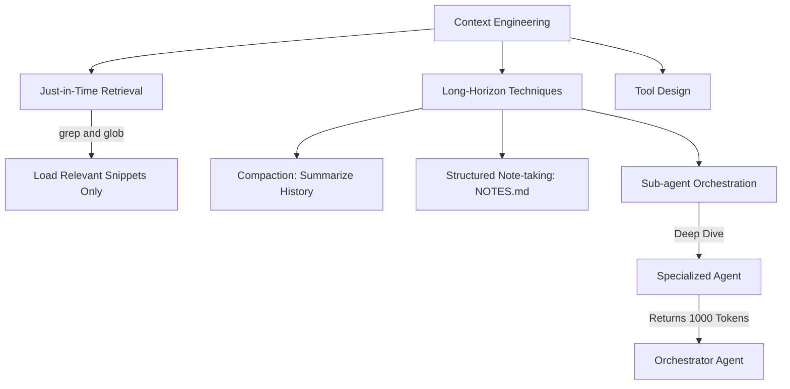

## Prompt Engineering is Dead. Long Live Context Engineering.

For years, "Prompt Engineering" was the buzzword. Developers spent hours tweaking the exact phrasing of their instructions: *"You are an expert coder. Take a deep breath and think step-by-step."* 

However, as models have grown vastly more intelligent (like Claude 3.5 Sonnet or GPT-4o), they no longer need heavy-handed emotional manipulation to perform well. Instead, the primary bottleneck in building effective AI agents has shifted to how we manage the data we feed them. 

Anthropic defines this new discipline as **Context Engineering**. It is the systematic curation of the optimal set of tokens—instructions, tool schemas, conversation history, and file data—to maximize a model's "attention budget."

## The Attention Budget and Context Rot

Imagine trying to read a 1,000-page textbook, and then being asked to instantly recall a single, highly specific sentence from page 4. Even with a massive context window (like 200,000 tokens), LLMs struggle with this. Every token you add to the context window acts as "noise" that slightly dilutes the model's attention. 

If you just dump an entire codebase into the prompt, the model suffers from **Context Rot**. It becomes overwhelmed, hallucinates details, and its precision degrades. Context Engineering is about aggressively minimizing noise to keep the signal pure.

## Strategies & Architecture

### 1. Just-in-Time (JIT) Retrieval

Instead of loading all files upfront, a well-engineered agent uses self-contained tools to explore the system dynamically. Rather than reading a 5,000-line file, the agent is provided tools like `grep_search` (to search for specific regex patterns) and `glob` (to view directory structures). The agent explores the codebase surgically, reading only the specific lines of code (e.g., `start_line: 40, end_line: 60`) that are relevant to its immediate task.

### 2. Long-Horizon Techniques

When an agent needs to work for a long time, Context Engineers employ several techniques to keep the context window artificially lean:

- **Compaction:** Once a conversation history gets too long, the system pauses, asks the LLM to write a dense 500-word summary of everything that has happened, and then starts a *brand new* session with only that summary as the starting context.
- **Agentic Memory (`NOTES.md`):** Agents are given tools to write to a dedicated `NOTES.md` file outside their context window. They can "offload" thoughts, to-do lists, and architectural decisions to this file, reading it back only when needed. This acts as a secondary hard drive, freeing up the primary "RAM" (the context window).
- **Sub-agent Orchestration:** The ultimate form of Context Engineering. A primary "Orchestrator" agent runs with a very lean prompt. When a complex task arises (like researching a bug in a massive file), it delegates the task to a specialized "Sub-agent". The Sub-agent churns through 50,000 tokens of file data, figures out the bug, and then terminates—returning a concise, 200-token summary back to the Orchestrator. The Orchestrator's context remains pristine.

By treating the context window as a highly limited, precious resource, Context Engineering unlocks the true autonomous capabilities of modern LLMs.
