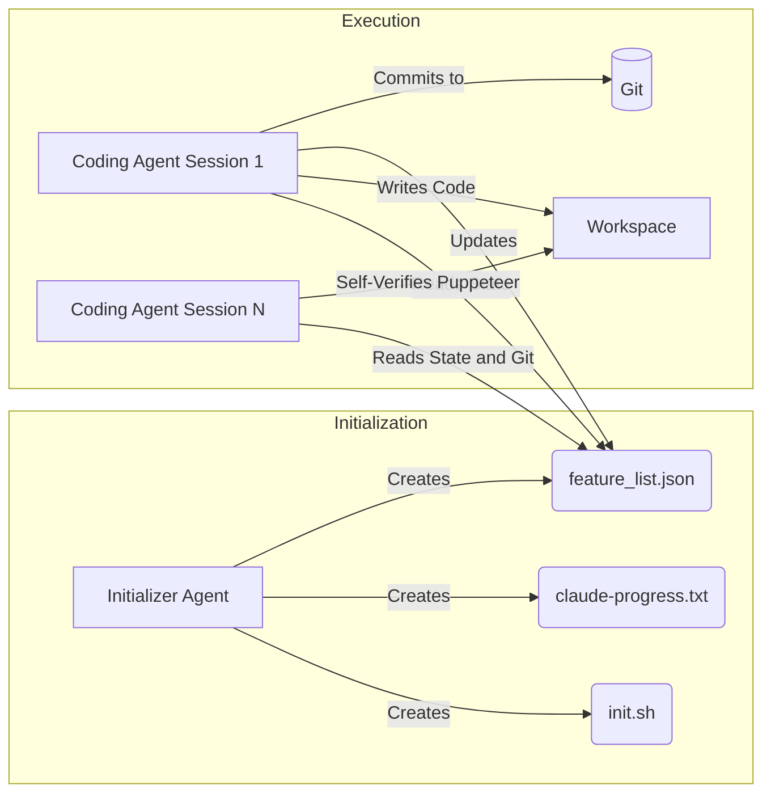

## The Long-Running Agent Problem

As AI agents transition from simple chatbots to autonomous software engineers, we encounter a massive challenge: **The Long-Running Agent Problem**. 

Large Language Models (LLMs) operate within a fixed "context window"—a limit on how much text they can "remember" at one time. When an agent is tasked with building a complex, full-stack application, it requires dozens, if not hundreds, of conversational turns to plan, write, debug, and test the code. 

If an agent tries to "one-shot" a complex application in a single session, it will inevitably run out of context. Once the context window fills up, the agent begins to forget its original instructions, loses track of its current task, or prematurely declares victory simply because it doesn't have the "mental space" to continue. 

To solve this, Anthropic engineers developed a human-inspired "harness" that bridges the memory gap between multiple discrete agent sessions.

## The Two-Fold Agent Architecture

Instead of relying on one massive, monolithic session, the solution uses a **Two-Fold Agent System** that relies on strict state handoffs.

### Phase 1: The Initializer Agent

The first phase of the harness is run exactly once by the **Initializer Agent**. Its entire job is to read the user's high-level request, scaffold the environment, and—most importantly—create structured state files that future agents will use to orient themselves. 

It generates:
- `init.sh`: A script containing all necessary setup commands (e.g., `npm install`, `docker-compose up`).
- `claude-progress.txt`: A human-readable and machine-readable log of what the overall goal is and what the current status is.
- `feature_list.json`: A comprehensive, granular checklist of every requirement. Crucially, the Initializer Agent marks every single requirement in this file as `"status": "failing"`.

### Phase 2: The Coding Agent (Iterative Sessions)

With the environment prepped, the **Coding Agent** takes over. However, this agent is not allowed to run forever. It is designed to be spun up, do a very specific chunk of work, and then be safely terminated.

1. **Orientation:** When a new Coding Agent session starts, it doesn't need the entire chat history. It simply reads the `feature_list.json`, identifies the *first* feature marked as `failing`, and makes that its sole objective for the session.
2. **Self-Verification:** To ensure it actually completed the task, the agent utilizes a Puppeteer MCP (Model Context Protocol). This allows the agent to literally open a headless browser, navigate to the local development server, and visually verify that the button it just coded actually works.
3. **State Check-in:** Once the agent proves the feature works, it updates `feature_list.json` to `"status": "passing"`.
4. **Git as Memory:** Finally, the agent commits its work to Git with a descriptive message. 

Because the state is saved structurally in JSON and Git, the current session can safely die. When the *next* session spins up, it reads the JSON, sees the previous feature is "passing", picks the next "failing" feature, and continues the work seamlessly. This "harness" effectively grants agents infinite memory and infinite persistence.
