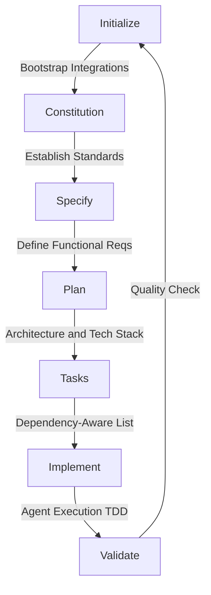

## The Fall of "Vibe Coding"

In the early days of generative AI for software engineering, developers relied heavily on what the industry colloquially calls **"vibe coding."** This is the practice of throwing a loose, unstructured prompt at an AI (like "build me a React app that does X") and hoping for the best. While it works for weekend prototypes, it fails catastrophically in enterprise environments. It lacks predictability, testability, and architectural rigor. 

When you vibe code, the AI is forced to make hundreds of micro-decisions about your tech stack, your styling preferences, and your business logic. If it guesses wrong, you spend hours debugging AI-generated spaghetti code.

## The Shift to Spec-Driven Development (SDD)

**Spec-Kit** introduces a paradigm shift known as **Spec-Driven Development (SDD)**. In SDD, specifications are no longer just passive markdown files that sit in a Wiki gathering dust. Instead, they become **executable blueprints**.

With Spec-Kit, developers focus entirely on defining the "what" and the "why"—the product scenarios, user experiences, and predictable outcomes. The AI agent is then strictly constrained to follow these blueprints, transforming high-level requirements into working implementations through a highly structured, multi-step refinement process.

## The 7-Step Executable Lifecycle

The SDD workflow is managed via the `specify` CLI tool, which ensures that the AI never writes a single line of application code until the architectural rules are firmly established.

Let's break down exactly what happens in each phase:

1. **Initialize:** This is the bootstrapping phase. The CLI sets up the project directory, installs necessary dependencies, and configures agent integrations (connecting your workspace to tools like GitHub Copilot or Anthropic's Claude).
2. **Constitution:** Before any features are discussed, you establish governing principles. A "Constitution" file is created that dictates your project's strict standards. It tells the AI: "Always use TailwindCSS for styling," "Never use `any` in TypeScript," or "Always write Jest unit tests." The AI must obey this constitution globally.
3. **Specify:** Here, you define the functional requirements. You write out the exact user stories and scenarios. "A user must be able to log in using OAuth2." This acts as the source of truth for *what* needs to be built.
4. **Plan:** The agent reads the Specification and the Constitution, and proposes a technical architecture. It decides on the directory structure, the database schemas, and the API routes required to fulfill the specification.
5. **Tasks:** The plan is broken down into a granular, dependency-aware task list. The AI cannot build the frontend login button until the backend OAuth route is marked as complete. This prevents the AI from getting confused or hallucinating APIs that don't exist yet.
6. **Implement:** Finally, code is written. The agent executes the tasks in order. Crucially, it follows a Test-Driven Development (TDD) approach: it writes a failing test based on the spec, writes the code to make it pass, and moves on.
7. **Validate:** The system performs a cross-artifact consistency analysis. It checks the final code against the original Specification and Constitution to ensure no rules were broken and no requirements were missed.

By adopting SDD, engineering teams can safely scale AI code generation, turning chaotic "vibes" into predictable, enterprise-grade software delivery.
