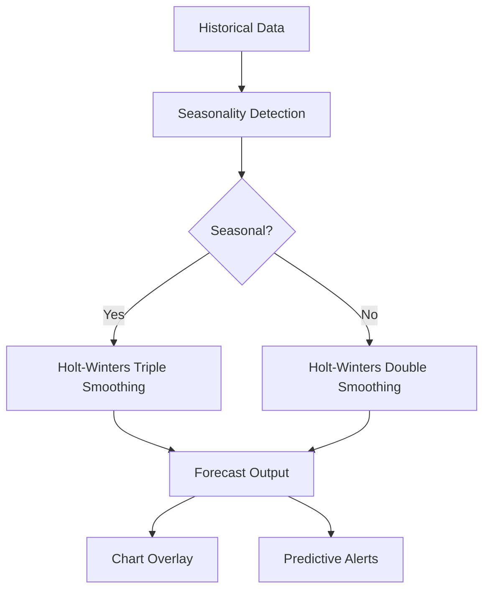

## Overview

**NRQL predictions** in New Relic uses your time series' historical data patterns to predict future trends, providing insights into how metrics might behave in the future.

> [!IMPORTANT] NRQL predictions are only compatible with time series queries using the `TIMESERIES` clause.

## How It Works

The system fits a machine learning model to historical data and projects it forward. It supports both **seasonal** and **non-seasonal** time series.

### Algorithm

NRQL predictions use the **Holt-Winters** (triple exponential smoothing) algorithm:

| Seasonality | Description | Min Data Required |
|-------------|-------------|-------------------|
| Hourly | Each minute behaves like the same minute in past hours | 2 hours |
| Daily | Each hour mirrors the same hour from yesterday | 2 days |
| Weekly | Each day repeats weekly patterns | 2 weeks |

## Usage

Basic prediction query:

```sql
FROM Transaction SELECT count(*) WHERE error IS TRUE TIMESERIES PREDICT
```

With a custom prediction window:

```sql
FROM Transaction SELECT count(*) WHERE error IS TRUE TIMESERIES PREDICT BY 30 minutes
```

With specified seasonality:

```sql
FROM Transaction SELECT count(*) WHERE error IS TRUE TIMESERIES PREDICT holtwinters(seasonality: 1 hour)
```

## When to Use Predictions

- Disk space running out as log volume increases
- Memory leaks slowly consuming container resources
- Projecting future infrastructure costs based on growth trends

## System Architecture



## Hyperparameters

For advanced users, you can tune the model:

| Parameter | Effect | Range |
|-----------|--------|-------|
| `alpha` | Level smoothing — higher = more weight on recent values | 0 to 1 |
| `beta` | Trend smoothing factor | 0 to 1 |
| `gamma` | Seasonal smoothing (not for non-seasonal) | 0 to 1 |
| `phi` | Trend damping — lower = flatter long-term forecast | 0.98 to 1 |

Example with all parameters:

```sql
FROM Transaction SELECT count(*) WHERE error IS TRUE TIMESERIES
PREDICT holtwinters(alpha: 0.2, beta: 0.5, gamma: 0.5, phi: 0.99)
BY 1 hour USING 2 hours
```

> [!TIP] The default `PREDICT` clause (no extra keywords) gives the best results for most use cases. Only customize if you need fine-grained control.

