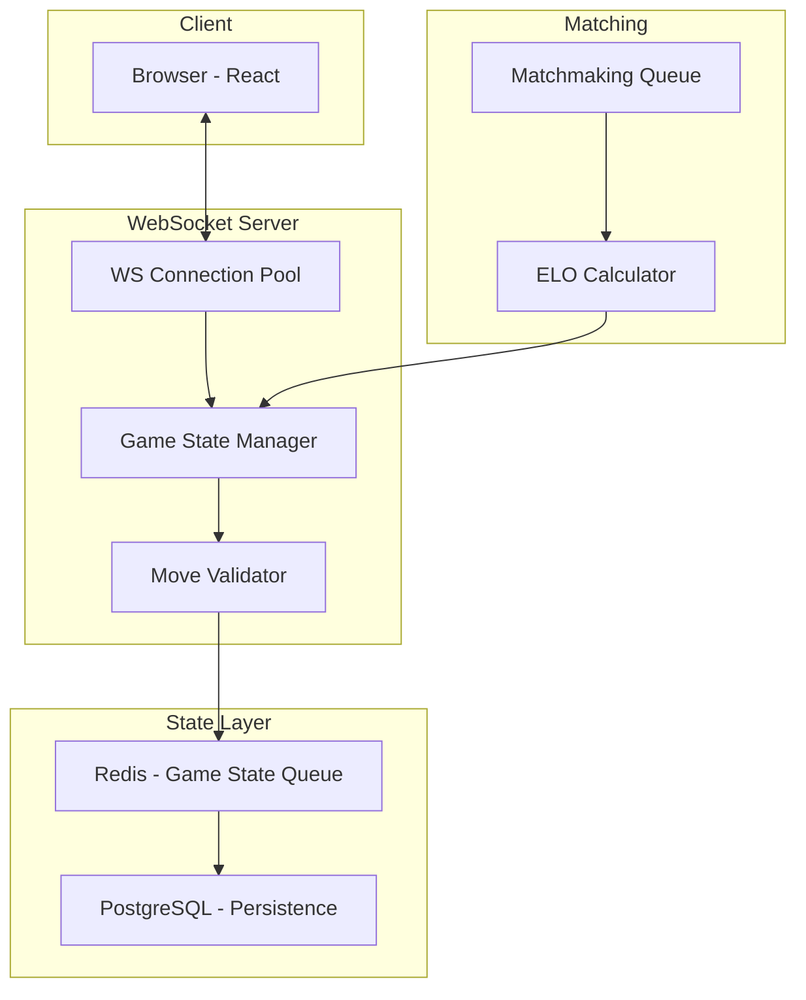

## Why Real-Time is Hard

Most web apps are request-response: client asks, server answers. Real-time inverts this — the server *pushes* data to clients the moment something happens. This sounds simple but has sharp edges.

> [!WARNING] Don't reach for WebSockets until you've exhausted polling and SSE. Real-time infrastructure is operationally expensive.

## Architecture Overview



## The Move Pipeline

Every chess move goes through this sequence and must complete in **<50ms**:

| Step | Action | Budget |
|------|--------|--------|
| 1 | Receive move via WebSocket | ~1ms |
| 2 | Validate move legality | ~2ms |
| 3 | Persist to Redis (game state) | ~3ms |
| 4 | Broadcast to opponent WS | ~5ms |
| 5 | Async write to Postgres | ~40ms (non-blocking) |

**Total round-trip: ~11ms actual, ~50ms worst case**

## WebSocket Connection Management

```typescript
class GameConnectionManager {
  private rooms = new Map<string, Set<WebSocket>>();

  join(gameId: string, ws: WebSocket) {
    if (!this.rooms.has(gameId)) {
      this.rooms.set(gameId, new Set());
    }
    this.rooms.get(gameId)!.add(ws);

    ws.on("close", () => this.leave(gameId, ws));
  }

  broadcast(gameId: string, message: GameEvent, exclude?: WebSocket) {
    const room = this.rooms.get(gameId);
    if (!room) return;

    const payload = JSON.stringify(message);
    for (const client of room) {
      if (client !== exclude && client.readyState === WebSocket.OPEN) {
        client.send(payload);
      }
    }
  }

  leave(gameId: string, ws: WebSocket) {
    this.rooms.get(gameId)?.delete(ws);
  }
}
```

## Redis as Game State Queue

Redis gives us atomic operations with microsecond latency — perfect for game state:

```typescript
// Store game state atomically
await redis.hset(`game:${gameId}`, {
  fen: newPosition,      // FEN string = full board state
  turn: nextPlayer,
  moveCount: count,
  lastMove: JSON.stringify(move),
  updatedAt: Date.now()
});

// Set TTL — games auto-expire after 2 hours of inactivity
await redis.expire(`game:${gameId}`, 7200);
```

## ELO Rating System

The ELO formula is beautifully simple:

```typescript
function calculateElo(
  playerRating: number,
  opponentRating: number,
  result: 1 | 0.5 | 0  // win / draw / loss
): number {
  const K = 32;  // K-factor: how much each game affects rating
  const expected = 1 / (1 + Math.pow(10, (opponentRating - playerRating) / 400));
  return Math.round(playerRating + K * (result - expected));
}
```

## Lessons Learned

> [!IMPORTANT] **Memory leak hunting**: WebSocket connection objects accumulate if you don't clean up on disconnect. Always implement a heartbeat + cleanup cycle.

1. **Use a connection registry** — Don't let WS references float. Track every connection in a Map keyed by userId.
2. **Separate WS server from HTTP server** — Different scaling characteristics. WS is long-lived, HTTP is burst.
3. **Redis for ephemeral state, Postgres for durable state** — Never write every move directly to Postgres.
4. **Heartbeats are mandatory** — Clients behind NAT firewalls silently drop idle connections after ~60s.

```typescript
// Heartbeat implementation
const HEARTBEAT_INTERVAL = 30_000;

function setupHeartbeat(ws: WebSocket) {
  let isAlive = true;

  ws.on("pong", () => { isAlive = true; });

  const interval = setInterval(() => {
    if (!isAlive) return ws.terminate();
    isAlive = false;
    ws.ping();
  }, HEARTBEAT_INTERVAL);

  ws.on("close", () => clearInterval(interval));
}
```

