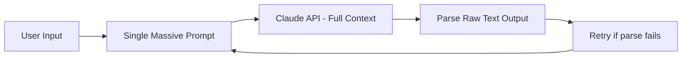
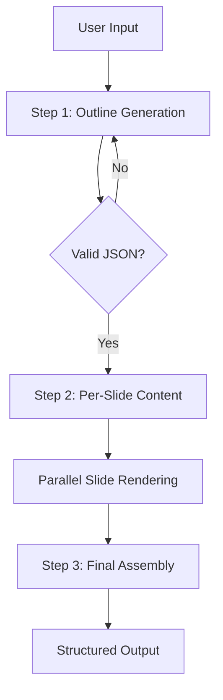

## The Problem

When I joined Binocs, the AI presentation pipeline was burning **$1.00 per slide** generated. At scale, this made the feature economically unviable for our users.

> [!IMPORTANT] High per-request LLM costs are almost always an architecture problem, not a model selection problem.

## Root Cause Analysis

The original pipeline worked like this:



**Problems identified:**

| Issue | Impact |
|-------|--------|
| Entire deck generated in one prompt | Massive token count, high cost |
| No structured output — free-form text | Frequent parse failures → retries |
| Retries sent full context again | 3-5x cost multiplier on failures |
| No caching of repeated sub-tasks | Redundant API calls |

## The Solution: Prompt Chaining + Structured Outputs

> [!TIP] Break one expensive prompt into a chain of cheap, focused prompts. Each step does one thing and outputs structured JSON.

### New Architecture



### Implementation

**Step 1 — Outline generation (cheap, cached):**

```typescript
const outline = await anthropic.messages.create({
  model: "claude-haiku-4-5",  // cheapest model for structural tasks
  max_tokens: 512,
  messages: [{
    role: "user",
    content: `Generate a JSON outline for a presentation about: ${topic}

    Return ONLY valid JSON matching this schema:
    { "slides": [{ "title": string, "key_points": string[] }] }`
  }]
});
```

**Step 2 — Per-slide content (parallel, focused):**

```typescript
const slides = await Promise.all(
  outline.slides.map(slide =>
    anthropic.messages.create({
      model: "claude-haiku-4-5",
      max_tokens: 256,
      system: "You are a concise presentation writer. Output valid JSON only.",
      messages: [{
        role: "user",
        content: `Write slide content for: "${slide.title}"
        Key points: ${slide.key_points.join(", ")}
        Return: { "body": string, "speaker_notes": string }`
      }]
    })
  )
);
```

## Results

| Metric | Before | After | Change |
|--------|--------|-------|--------|
| Cost per slide | $1.00 | $0.01 | **-99%** |
| Parse failure rate | ~40% | <1% | **-97.5%** |
| Generation time | 8-12s | 2-3s | **-75%** |
| Retry rate | ~2.5x multiplier | 1.02x | **Eliminated** |

## Key Lessons

1. **Match model to task** — Use Haiku for structured/simple tasks, Sonnet/Opus only when reasoning depth is needed
2. **Always use structured outputs** — JSON schema enforcement eliminates parse failures
3. **Parallelize independent steps** — Per-slide generation is embarrassingly parallel
4. **Cache aggressively** — Anthropic's prompt caching can reduce repeated context costs by up to 90%

> [!NOTE] This pattern (chain of focused prompts → structured outputs → parallel execution) is now the standard at Binocs for all AI pipelines.

## Code Pattern to Steal

```typescript
// The golden pattern for cost-efficient LLM pipelines
async function chainedPipeline<T>(
  steps: Array<{ prompt: string; schema: T }>,
  context: Record<string, unknown>
): Promise<T[]> {
  const results: T[] = [];

  for (const step of steps) {
    const result = await callLLM(step.prompt, context);
    results.push(validateSchema(result, step.schema));
    Object.assign(context, { previousResult: result });
  }

  return results;
}
```

