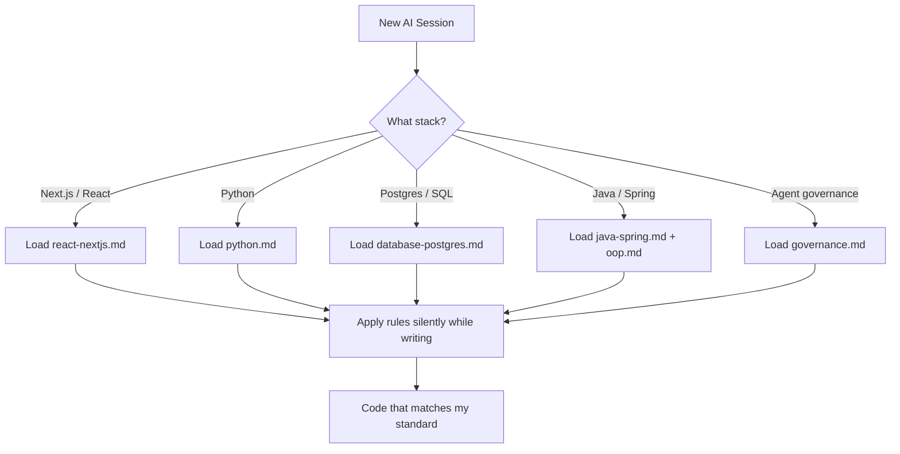
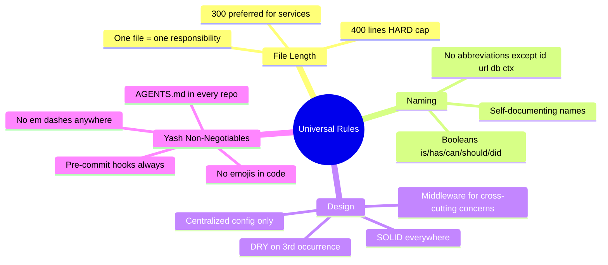
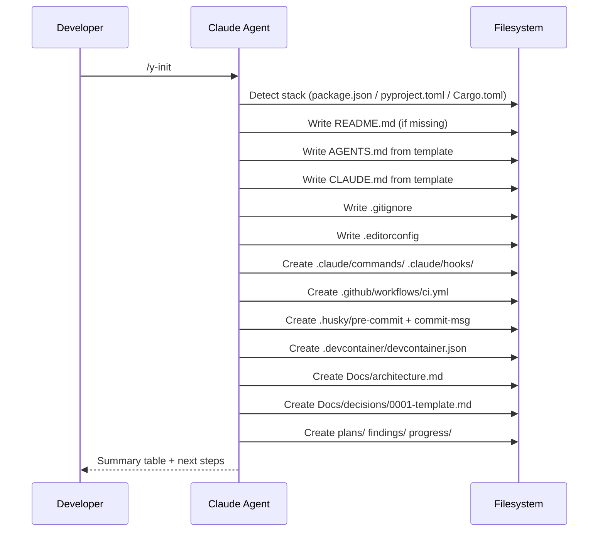
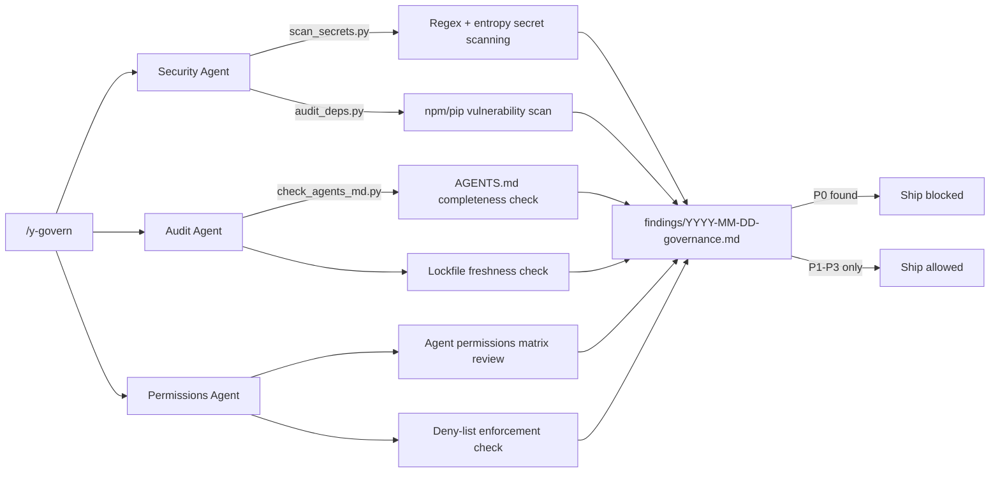
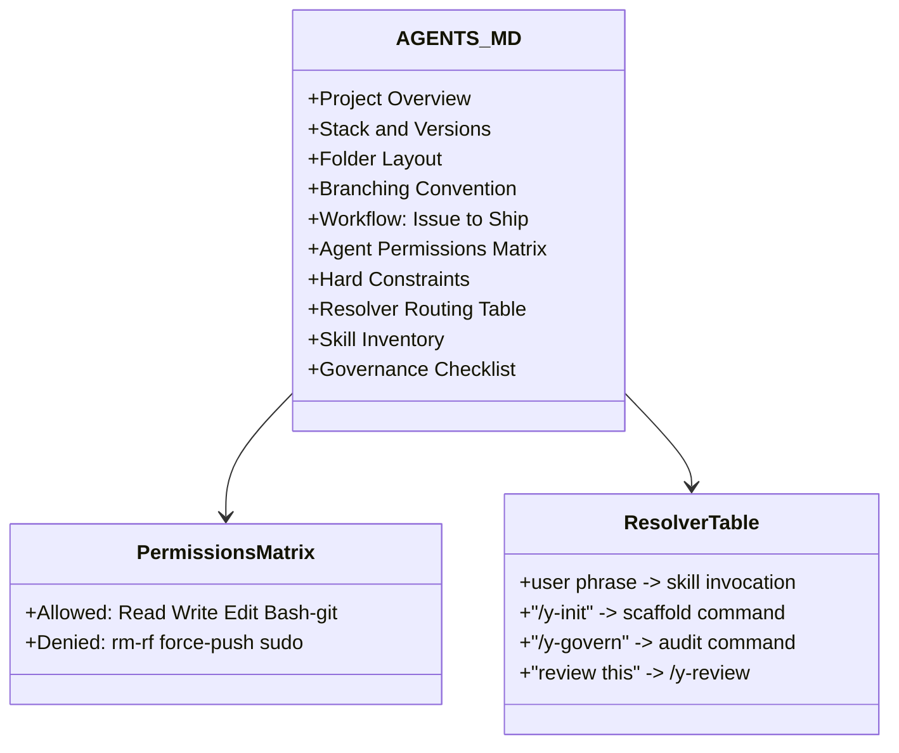
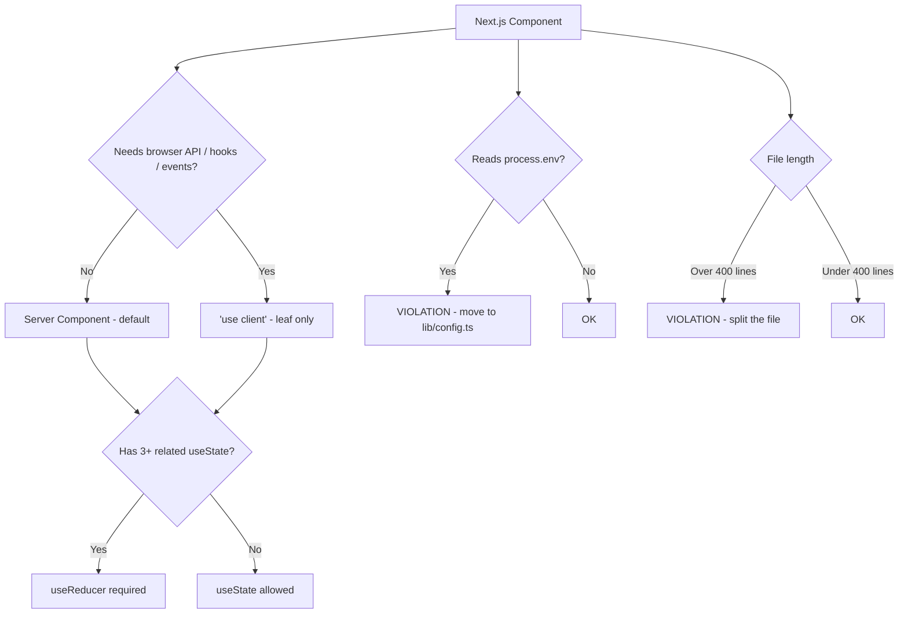
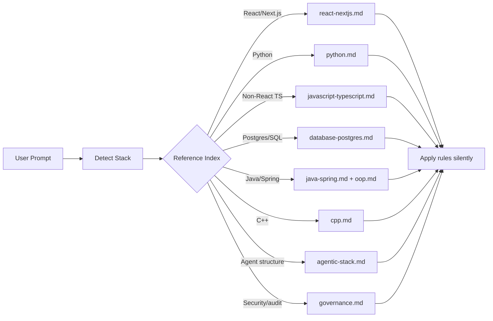
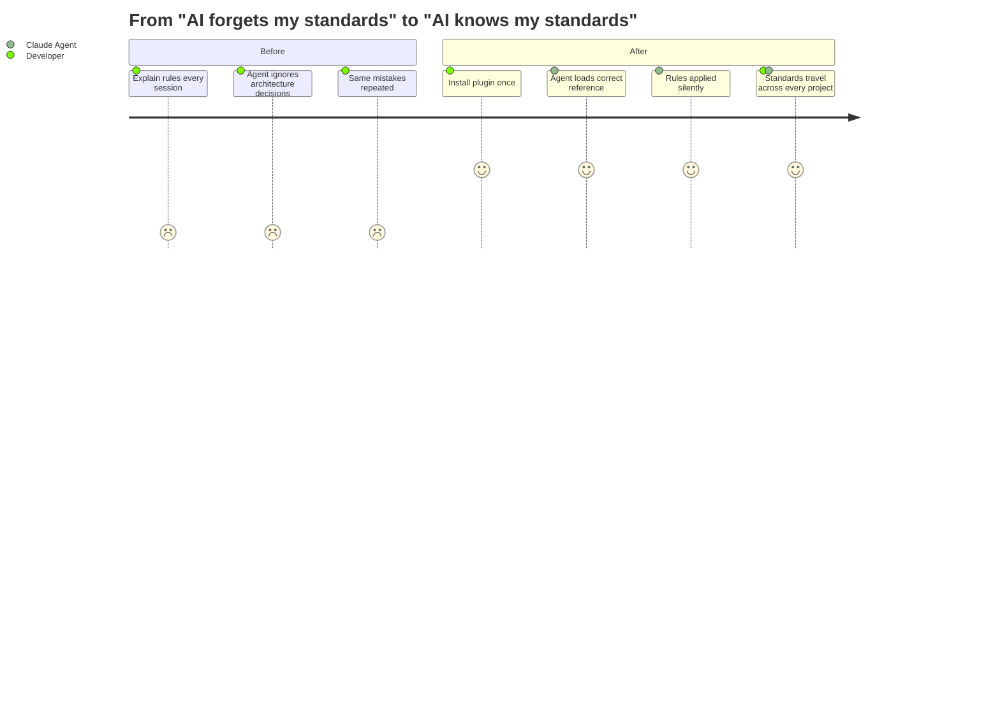

# the_y_coding_standard: I Encoded My Entire Engineering Brain Into a Claude Code Plugin

I kept running into the same problem.

Every new AI session, I had to re-explain the same decisions. "Use the repository pattern." "No process.env outside lib/config.ts." "useReducer when state grows past three fields." "400 lines max per file, no exceptions."

Good engineers have strong opinions. The problem is that AI agents are stateless by default - they forget your opinions the moment the session ends.

So I built a fix. I encoded everything into a plugin.

---

## What is the_y_coding_standard?

It is a Claude Code plugin - a structured set of skills, commands, and reference files that any AI agent picks up automatically. Install it once and every session inherits my full engineering standard without me saying a word.

No lecture. No reminders. The agent just knows.

```
the_y_coding_standard/
  skills/the-y-coding-standard/
    SKILL.md                  - main entry point + trigger logic
    references/
      react-nextjs.md         - Next.js App Router standards
      python.md               - Python standards (uv, ruff, mypy)
      database-postgres.md    - Drizzle, schema design, indexing
      agentic-stack.md        - AGENTS.md format + folder layout
      governance.md           - security audit dimensions
      ... 5 more stacks
  commands/
    y-init.md                 - scaffold a full project in one command
    y-govern.md               - parallel security audit agents
    y-review.md, y-ship.md, y-retro.md ...
```

---

## The Core Idea: Standards That Travel With You

Most coding standards live in a repo's README that nobody reads. Or in a Notion doc that nobody updates. Or in a senior engineer's head that leaves when they leave.

Mine live in a plugin that loads automatically.



The key design choice: load only the relevant reference file for the current stack. Never all ten at once. This keeps the agent focused and the context window clean.

---

## The Universal Rules

Before any stack-specific rules, there are rules that apply everywhere. These override everything.



These are not preferences. They are hard rules. The word "opinionated" in the README is not a disclaimer - it is a feature.

---

## /y-init: One Command to Scaffold Everything

The most used command. Run `/y-init` in any new repo and it builds the full agentic engineering stack in the correct order.



The output is not just files. It is a complete workflow scaffold: CI runs on every push, pre-commit hooks block bad commits, the `Docs/` folder enforces architecture documentation, and `plans/findings/progress/` give every AI session structured places to put its work.

---

## /y-govern: Parallel Security Audit Agents

Before shipping anything significant, `/y-govern` dispatches three parallel sub-agents:



Severity is explicit:
- **P0 (Critical):** blocks ship - hardcoded secrets, unsafe eval on untrusted input
- **P1 (High):** fix before release - missing pre-commit hooks, unverified dependencies
- **P2 (Medium):** queue for backlog
- **P3 (Low):** track, non-blocking

This runs in parallel so all three audits complete in the time the slowest one takes.

---

## The AGENTS.md Contract

Every repo that uses this standard gets an `AGENTS.md` file. This is the universal agent contract - a machine-readable document that tells any AI agent everything it needs to know about the project before writing a single line.



"If it is not on disk, it did not happen." Every agent action produces a named artifact. Plans go in `plans/`. Investigation outputs go in `findings/`. Session journals go in `progress/`.

---

## Stack-Specific Standards: Next.js

The `react-nextjs.md` reference is where I spend the most time. These are the rules that Next.js App Router projects follow automatically:



The state management hierarchy is strict: URL state first, then server state, then local state with `useReducer`, then Context, then Zustand as a last resort. `useEffect + setState` for data fetching is banned - Server Components use direct async/await.

---

## Stack-Specific Standards: Python

Python projects follow an equally strict set of rules:

| Rule | Standard |
|------|----------|
| Package manager | `uv` only. Poetry as fallback. `pipenv` banned. |
| Linting + formatting | `ruff` replaces black, isort, and flake8 |
| Type checking | `mypy --strict` in CI. No `any` without a comment. |
| Config | `pydantic-settings.BaseSettings`. Never `os.environ.get` scattered in code. |
| Project structure | Feature-based vertical slices: `features/users/`, `features/billing/` |
| FastAPI routers | 5-line body max. No SQL or business logic in routers. |
| Domain models | `@dataclass(frozen=True, slots=True)` for internal models. |
| Exceptions | Custom hierarchy in `exceptions.py`. Never bare `except:`. |
| Python version | Always the latest stable release - looked up at runtime, never hardcoded. |

The CI gate requires 90% test coverage. `uv sync --frozen`, `ruff check`, `ruff format --check`, `mypy --strict`, `pytest --cov` in that order.

---

## How I Built It

The plugin follows the Claude Code skill format: a directory with a `SKILL.md` entry point, reference files loaded on demand, and command definitions as markdown files.

The key architectural decision was the **Reference Index** - a routing table in `SKILL.md` that maps code contexts to reference files. This prevents the agent from loading all 10 reference files into context for a simple Python script fix.



The 37 eval cases in `evals/triggers.md` verify the routing is correct. Each case defines an input prompt and the expected positive or negative trigger behavior. This makes the skill testable.

---

## Why Open Source?

I built this for myself. But the problems it solves are not personal.

Every engineer who works with AI coding agents faces the same friction: the agent does not know your preferences, your architecture decisions, your hard constraints. You repeat yourself every session. The agent makes the same mistakes on the same patterns.

A shared standard - one that the community contributes to and extends - is more valuable than a personal one. If you have strong opinions about how Go services should be structured, or how Rails apps should handle config, or how Rust projects should enforce safety patterns - that knowledge belongs in a reference file that any agent can load.

The goal is a **universal standard for AI-assisted engineering** where the community's collective hard opinions become the agent's default behavior.

---

## Get Involved

The repo is at **github.com/yashs33244/the_y_coding_standard**.

The places where contributions matter most right now:
- New reference files for stacks not yet covered (Go, Rust, Ruby on Rails, .NET)
- Additional eval cases in `evals/triggers.md`
- Governance scripts in `skills/the-y-coding-standard/scripts/`
- Battle-testing the existing references against real production codebases

If you have opinions about how code should be written - and you have enough scars to back them up - they belong here.

---

## Summary



The best tools disappear into your workflow. You stop thinking about them and just build.

That is what this standard is trying to be.

---

*Star it. Fork it. Contribute a reference file. github.com/yashs33244/the_y_coding_standard*